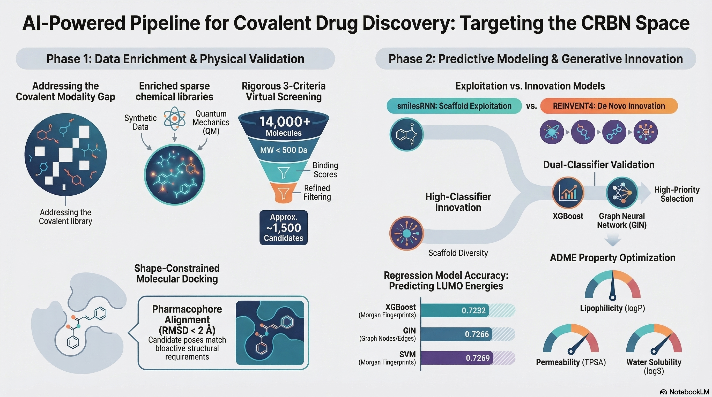

# Cheminformatics, QSAR, and Generative AI for CRBN-based Covalent Modulators

This repository contains the data, code, and pipelines associated with the study of **Cereblon (CRBN)-based binders and degraders**, focusing on the exploration of covalent modalities through traditional cheminformatics, quantum mechanics (QM), and artificial intelligence.

 

## Table of Contents
- [Overview](#overview)
- [Repository Structure](#repository-structure)
- [Project Workflow](#project-workflow)
- [Installation & Environments](#installation--environments)
- [Key Methodology](#key-methodology)
- [Results Summary](#results-summary)
- [References](#references)

---

## Overview
The goal of this project is to address the data bias in public CRBN datasets and explore the "hypothetical" chemical space of covalent binders targeting specific residues like **HIS-6** (IKZF2) and **CYS-11** (WIZ). The study spans the entire drug discovery pipeline, from data curation and QM-based library enrichment to virtual screening and generative molecular design.

## Repository Structure
The repository is organized into modules reflecting the study outlines:

*   `database/` & `C4_patent_extraction/`: Curated datasets from open-source and commercial databases, supplemented by patent mining.
*   `KNIME_pipeline/`: Workflows for tabular data curation, analysis, and visualization.
*   `QM_calculation/`: Semi-empirical and machine-learning force field calculations (XTB, FAIRCHEM) for electronic properties.
*   `covalency_classification/`: ML and GNN models for identifying covalent ligands.
*   `electrophilicity_regression/`: Regression models for LUMO energy and electrophilicity prediction.
*   `covalent_docking_VS/`: Virtual screening scripts using AutoDock-GPU with structural constraints.
*   `genAI/`: Scripts for `smilesRNN` and `REINVENT4` generative models.
*   `*.yml`: Conda environment files for project reproducibility.

## Project Workflow
1.  **Data Inspection & Curation**: Analyzing CRBN binders and simplifying hits using **Bemis-Murcko scaffolds** and deprotection.
2.  **Library Enrichment**: Generating synthetic data to fill the "covalent modality gap".
3.  **Physical Validation**: Implementing **shape-constrained molecular docking** to ensure realistic binding poses (RMSD < 2 Å).
4.  **QSAR Modeling**: Training classical ML (SVM, XGBoost) and GNNs (GCN, GAT, GIN) for classification and regression tasks.
5.  **Generative AI**: Utilizing RL-driven models to optimize novel covalent candidates based on properties like logP, TPSA, and logS.

## Installation & Environments
Specific environments are required for different stages of the pipeline. Use the provided `.yml` files to recreate them:
*   `autodock_env.yml`: For docking and virtual screening.
*   `deepchem_env.yml`: For GNN modeling and featurization.
*   `reinvent4_env.yml`: For generative AI tasks.
*   `xtb_uma_env.yml`: For QM calculations.

## Key Methodology
### Structural Constraints in Docking
Ligand preparation involves ETKDG-based conformational sampling followed by a **pharmacophore alignment filter**. This ensures the cyclic imide pharmacophore maintains a bioactive pose relative to the reference glutarimide.

### Electrophilicity Prediction (Regression)
Regression tasks target the prediction of **LUMO energies** calculated via QM, which serve as indicators for electrophilicity ($\omega$). Benchmarking shows that **GIN** and **XGBoost** provide high accuracy (R² ~ 0.72) with efficient deployment profiles.

### AI-Driven Generation
Two generative approaches were compared:
*   **smilesRNN**: High distribution fidelity, suitable for SAR exploitation.
*   **REINVENT4**: High scaffold innovation, ideal for *de novo* discovery of novel bioisosteres.

## Results Summary
The integrated pipeline successfully prioritized high-quality covalent candidates:
*   Refined a library of over 14,000 candidates to **1,500 high-priority compounds** using docking and empirical filters (MW < 500, nRotB < 7).
*   Identified **82 novel covalent structures** meeting dual-classifier checks and high drug-likeness (QED > 0.67).

## References
*   **RDKit**: Fundamental cheminformatics toolkit.
*   **AutoDock-GPU**: Covalent docking with flexible sidechains.
*   **XTB & FAIRCHEM**: Quantum chemical calculations.
*   **DeepChem & PyTorch**: GNN architecture foundation.

---
**Author:** Hao Lan
**Date:** 2026-03-16
