## Introduction
<p style="text-align: justify;">
In 2025, I published two posts exploring molecular modeling through AI co-folding and physics-based simulations for Structure-Based Drug Discovery (SBDD), drawing on my background in physical organic chemistry and biophysics. However, some pillars of modern computational drug discovery - <b>cheminformatics</b> and <b>machine learning (ML)</b> - have yet to be discussed here. During my time in the industry, these are the fields where I have experienced the most significant professional growth.
</p>
<p style="text-align: justify;">
In this post, I will share insights from my journey transitioning between the roles of a cheminformatician and an ML engineer within the biotech ecosystem. To demonstrate the real-world application of data science in drug discovery, I will present <b>a virtual screening (VS) workflow targeting the Cereblon (CRBN) chemical space for covalent drug discovery (Figure 1).</b> We will walk through a rigorous pipeline: from chemical database mining and library enumeration to molecular docking, QSAR modelling, and AI-driven generation - all guided by the rational constraints of organic and medicinal chemistry.  
</p>
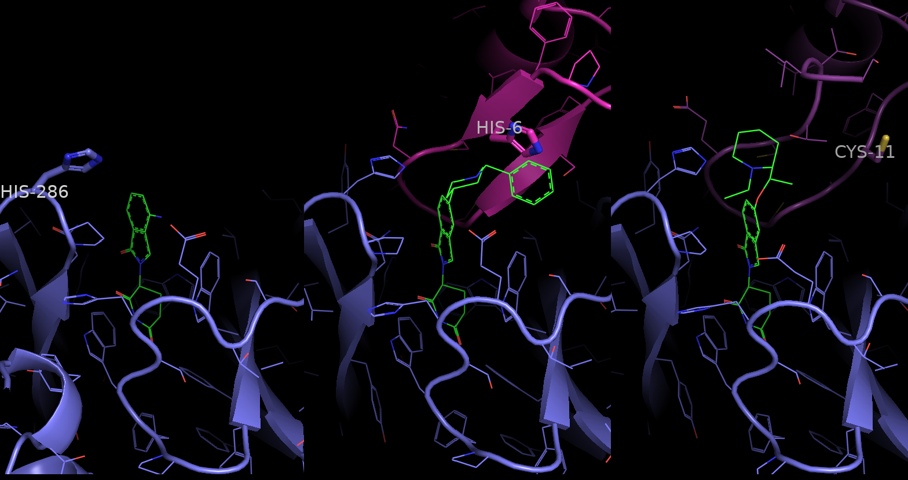<br>
<font size="2"><b>Figure 1.</b> Co-crystal structures of CRBN in complex with IMiD molecular glues. <b>Left:</b> Binary complex (PDB 4TZ4). <b>Center/Right:</b> Ternary complexes with neosubstrates <b>IKZF2</b> (PDB 7U8F) and <b>WIZ</b> (PDB 8TZX), highlighting the structural basis for covalent ligand design with potential warheads.</font><br>

## Study Outlines

1. <b>Data Inspection & Curation</b> - Analysing the chemical space of CRBN-based binders and degraders using both open-source and commercial databases.

2. <b>Chemical Library Enrichment</b> - Utilising traditional cheminformatics and Quantum Mechanics (QM) approaches to generate synthetic data, specifically addressing regions of insufficient chemical space coverage.

3. <b>Physical Validation via VS</b> - Implementing shape-constrained molecular docking to screen large-scale chemical libraries, refining the candidate space based on realistic binding poses and steric complementarity.

4. <b>QSAR Modelling & Hit Identification</b> - Developing classical ML (e.g., SVM, tree models) and Graph Neural Networks (GNNs) to classify, regress and prioritise chemical spaces of interest (specifically CRBN-based covalent modulators).

5. <b>Generative AI & Rational Optimisation</b> - Evaluating industry-standard generative models, including the smilesRNN module from the MorganCThomas/Nxera team and the REINVENT4 Reinforcement Learning (RL) platform developed by AstraZeneca, together with post-processing by alert filtering, descriptor scoring, and transferred QSAR models for the final selection.

## Chemical Database Search and Processing
<p style="text-align: justify;">
The public domain offers a vast array of chemical databases — including <b>PubChem</b>, <b>ChEMBL</b>, <b>ZINC</b>, and <b>Enamine</b> — each serving distinct research purposes. As a computational medicinal chemist supporting Targeted Protein Degradation (TPD) pipelines actively, I have found <b>BindingDB</b> and <b>MolecularGlueDB</b> particularly effective for capturing academic datasets.
</p>
<p style="text-align: justify;">
In an industrial setting, we also place a high premium on the latest competitive intelligence, often found in patent literature. Extracting, annotating, and structuralising this "dark data" requires significant effort... Fortunately, AI-powered tools like <b>DECIMER</b> (used later in this workflow) have streamlined the translation of chemical images into machine-readable formats. Furthermore, efficient drug design necessitates libraries built upon synthetically feasible building blocks. Suppliers like Enamine provide categorised catalogs that allow us to tailor our search criteria to the specific synthetic constraints of a project.
</p>
<p style="text-align: justify;">
While sourcing data is foundational, the engineering approach used to process it is often the differentiator in a project's success. For professional cheminformatics workflows, I prefer <b>KNIME</b> as learnt during the work. This GUI-based platform is exceptionally powerful for manipulating and visualising tabular data (such as CSV or SD files) through sequential nodes. Honestly KNIME has saved me countless hours typically spent on boilerplate data engineering with Python (using RDKit, Pandas, and NumPy modules). While LLM-driven AI agents are evolving, I remain cautious about fully delegating these tasks to them. I believe data processing in chemistry still requires deep domain expertise and the ability to perform real-time monitoring and debugging to ensure structural integrity.
</p>

### Open-Source Curation and Data Imbalance
<p style="text-align: justify;">
<b>Figure 2</b> illustrates the KNIME workflow I developed to aggregate and process CRBN chemical space data from BindingDB and MolecularGlueDB. Beyond generating the final dataset in SDF format, the pipeline extracts available PDB structural metadata for downstream structural analysis. To assess the chemical diversity, I employed <b>t-distributed Stochastic Neighbor Embedding (t-SNE)</b>, a dimensionality reduction technique used here to project the chemical space based on molecular fingerprints and <b>Tanimoto similarity</b>.
</p>
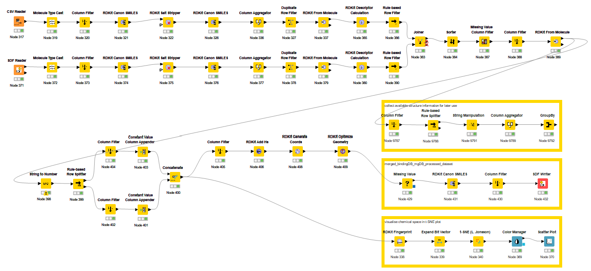
<font size="2"><b>Figure 2</b>. The KNIME pipeline to integrate two chemical database, check specific labelled information and visualise the chemical space on t-SNE plot.</font>
<br><br>
<p style="text-align: justify;">
Since high-molecular-weight PROTACs were filtered out, the remaining dataset consists of a few hundred small-molecule CRBN binders and glues. Given this relatively small scale, I utilised 1024-bit <b>Morgan fingerprints</b> (radius = 2, chirality ignored) without significant concern for bit collisions. The most labor-intensive phase, however, remains the manual classification of "active" versus "inactive" sets. This requires a detailed review of diverse data sources, varying biophysical or cellular assay conditions, and thresholding — all of which demand cautious, expert-led curation. As shown in <b>Figure 3</b>, a major challenge emerged: an overwhelming prevalence of "active" compounds relative to "inactive" labels. This reflects a pervasive <b>publication bias</b> in open databases, where academic research naturally prioritises and reports successful positive results.
</p>
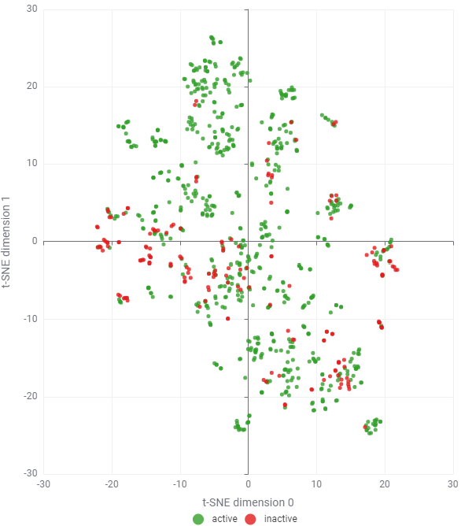
<font size="2"><b>Figure 3</b>. The t-SNE plot showing imbalanced data distribution between active and inactive CRBN chemical sets that against the need for ML/QSAR analysis properly.</font>
<br><br>
<p style="text-align: justify;">
In an industrial setting, the situation is usually opposed. In the <b>Design-Make-Test-Analyze (DMTA)</b> cycle, we typically generate far more negative data than positive hits. Relying solely on these limited and imbalanced public datasets for QSAR modeling is often not productive. To build a robust predictive model, we must look beyond these biased activity labels and seek opportunities in broader, unlabelled chemical libraries or through data augmentation.
</p>

### Commercial Database & Cheminformatics Analysis 
<p style="text-align: justify;">
Recently, Enamine released several targeted libraries focused on CRBN molecular glues. These datasets are highly informative and chemically diverse, spanning a range of scaffolds from <b>classic IMiDs</b> to newer derivatives such as Phenyl Amino Glutarimides (<b>PAG</b>), Phenyl Dihydrouracils (<b>PD</b>), Phenyl Glutarimides (<b>PG</b>), Acylated Amino Glutarimides (<b>AAG</b>), and Avadomide.
</p>
<p style="text-align: justify;">
Using a custom KNIME workflow (<b>Figure 4, upper</b>), I analysed this chemical space at multiple levels. At the molecular level, the dataset contains over 3,000 unique canonical SMILES strings (processed by stripping stereochemical tokens like '@' for simplified initial analysis). As expected, the vast majority of these molecules contain <b>at least one cyclic imide substructure</b>, acting as the essential pharmacophore for CRBN binding (<b>Figure 4, lower</b>).
</p>
<p style="text-align: justify;">
However, raw t-SNE visualisations at the molecular level can appear "fuzzy" due to the high density of similar or near-duplicate analogs — a problem that alternative algorithms like UMAP also struggled to resolve. To achieve a more distinct and interpretable visualisation, I abstracted the molecules to their <b>Bemis-Murcko scaffolds</b> (retaining only the union of ring systems and linkers) and performed <b>Maximum Common Substructure (MCS)</b> decomposition.
</p>
<p style="text-align: justify;">
This hierarchical mapping revealed that while the majority of core scaffolds are rooted in the IMiD class, the merged dataset successfully captures modern chemical matter. For instance, cores 10 and 21 respectively represent the more recently developed PAG and PG scaffolds. This structural decomposition allows us to better navigate the diversity of the library and identify gaps for potential expansion.
</p>
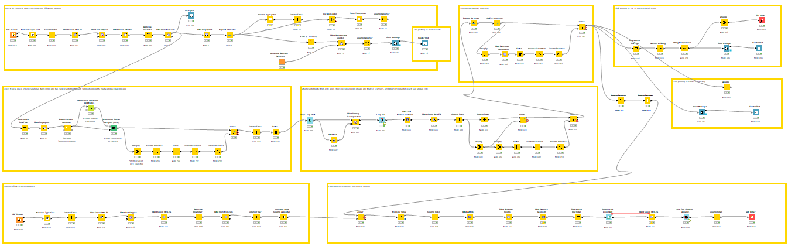<br>
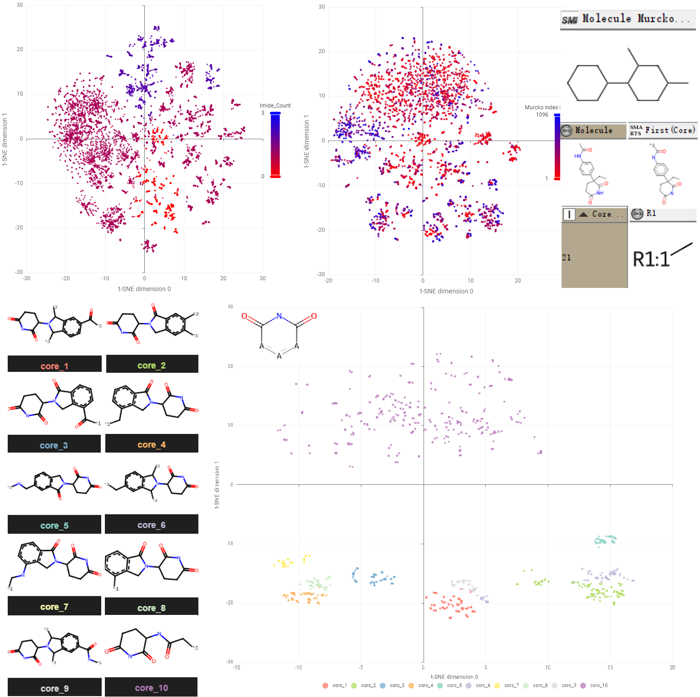
<font size="2"><b>Figure 4</b>. The KNIME workflow to analyse CRBN-related databases integrated from <i>Enamine</i> catalog, showing major distributions of chemical space represented at diverse levels based on Bemis-Murcko, MCS and R-group decomposition.</font><br>

### Addressing the Covalent Modality Gap
<p style="text-align: justify;">
By merging the curated public data with the Enamine dataset, I was able to significantly enrich the available chemical space (<b>Figure 5</b>). There is minimal overlap between the two: This is likely because commercial suppliers prioritise novel, synthetically accessible analogs rather than simply replicating previously reported active substances. Despite this expansion, a critical gap remains: <b>Covalent CRBN binders and their corresponding degraders are still under-represented, accounting for only ~150 entries out of the 4,500 records in the final library.</b>
</p>
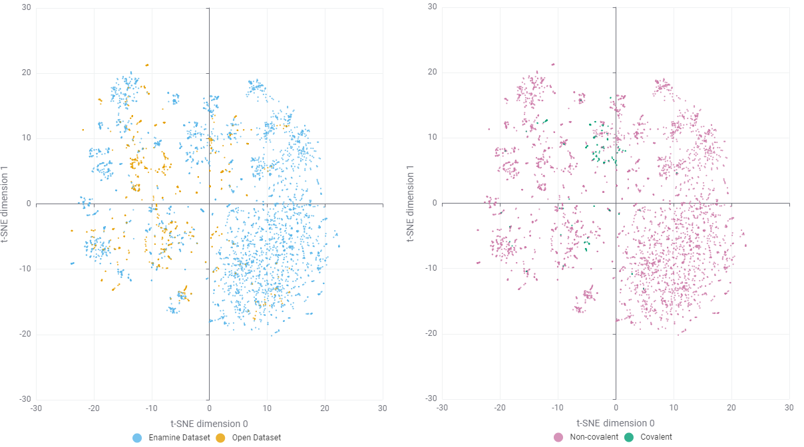
<font size="2"><b>Figure 5</b>. Two t-SNE maps showing the limited chemical space of covalent CRBN binders available from public and Enamine databases.</font>
<br><br>
<p style="text-align: justify;">
To address this sparsity, I conducted a targeted literature and patent search, focusing on work from the <b>Lyn Jones group</b> in Dana-Farber and a recent <b>C4 Therapeutics</b> patent (<b>WO2025/096856A1</b>). This yielded approximately 30 additional covalent CRBN binders not present in the initial databases (<b>Figure 6</b>). Most of these ligands function as reversible-covalent binders that target <b>HIS-353</b> (as shown in <b>Figure 1, left</b>) through a <b>sulfonyl fluoride</b> warhead.
</p>
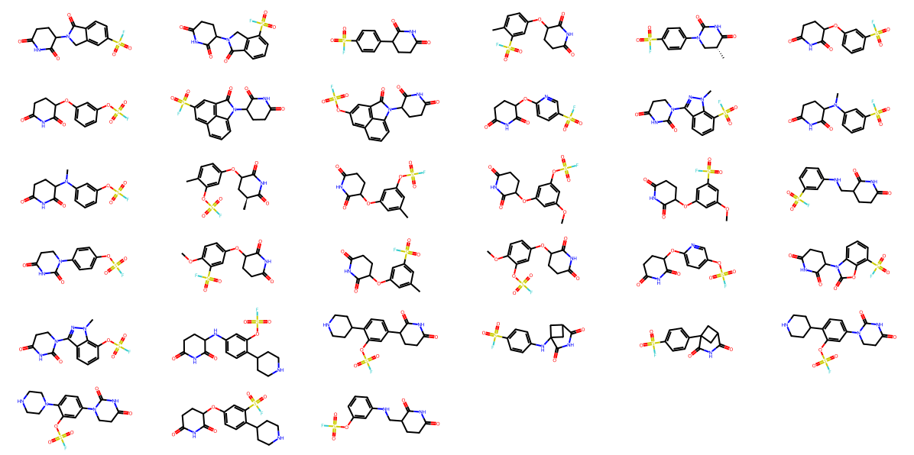
<font size="2"><b>Figure 6</b>. The structure of some novel CRBN binders based on the covalency with HIS-353, extracted from recent journals and patents by AI tool <i>DECIMER</i>.</font>
<br><br>
<p style="text-align: justify;">
From my perspective as an industrial drug designer, the potential for covalent modalities in CRBN-dependent degradation is far broader than what is currently documented. Recent structural data and pipelines from <b>AstraZeneca, BMS, Monte Rosa, and Novartis</b> suggest several untapped opportunities. For instance:

1. The <b>IKZF2</b> neosubstrate features a <b>HIS-6</b> residue on its $\beta$-sheet near the G-loop (<b>Figure 1, middle</b>).
2. The <b>WIZ</b> neosubstrate also contains a <b>CYS-11</b> residue positioned near the IMiD-binding pocket on CRBN (<b>Figure 1, right</b>).

Both residues present strategic handles for covalent engagement. <b>The challenge now lies in how to "invent" and explore this hypothetical chemical space <i>in silico</i> to target these specific residues.</b>
</p>

## Synthetic Data Generation via Classic Cheminformatics 
<p style="text-align: justify;">
In cheminformatics, one of the most robust methods for library enumeration is the use of <b>virtual reactions</b> between building blocks (synthons). This approach ensures that the resulting "drug-like" molecules are synthetically accessible for wet-lab validation. Given that most IMiD and glutarimide derivatives in my current dataset feature phenyl or other aromatic systems, I utilised a <b>C-H activation strategy</b> to append covalent warheads virtually.
</p>
<p style="text-align: justify;">
For this rapid enrichment, I defined a two-component <b>Reaction SMARTS</b> using RDKit to functionalize sp2-hybridised [c;H1] atoms on each candidate in the dataset (<b>Figure 7</b>). I curated a suite of 10–15 warheads commonly employed in covalent drug discovery for targeting proximal cysteine or histidine residues. This strategy successfully transformed non-covalent precursors into a vast, covalent-focused chemical space.
</p>
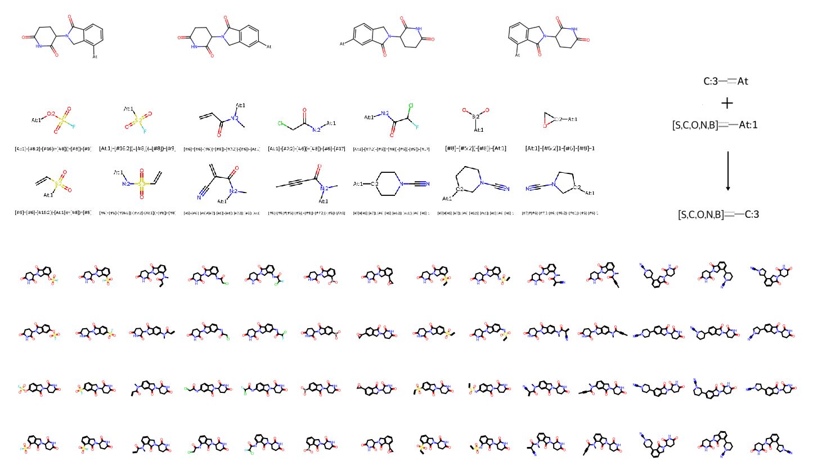
<font size="2"><b>Figure 7</b>. The example of two-component reaction to enumurate one IMiD candidate with covalent handles using aromatic C-H functionalisation virtually.</font>
<br><br>
<p style="text-align: justify;">
To ensure the robustness and quality of the generated library, I implemented several critical post-processing steps:

1. <b>Deprotection</b>: Before the aromatic C-H activation, I applied other SMARTS-based transformations to remove common protecting groups (e.g., converting carbamates to amines, ester hydrolysis, and hydroxyl deprotections).

2. <b>Scaffold Simplification</b>: Prior to covalent transformation, I also abstracted the diverse structures into their Bemis-Murcko scaffolds to simplify the hit library, reducing the starting pool from approximately 4,000 to 2,500 unique frameworks.

3. <b>Quality Control</b>: After enumeration, I verified the presence of the essential imide pharmacophore and filtered out undesired substructures using a modified PAINS list - carefully excluding the phthalimide core and the intended reactive warheads from the 'bad' SMARTS filter.
</P>
<p style="text-align: justify;">
During this process, I leveraged AI agents like <b>Gemini</b> and <b>Claude</b> via <b>Copilot Pro</b> to assist with coding. While these LLMs generated individual RDKit functions with high precision, they struggled with the "big picture" logic required for complex database workflows. Without iterative, human-led direction (through structured markdown protocols and specific prompts), the agents sometimes failed to clean protective groups or generated invalid SMARTS variables. This underscores a current truth for industry-level applications: While LLMs are powerful coding assistants, we still require <b>chemistry-specialised language models</b> to fully automate the digital stage of drug discovery with scientific logic.
</p>
<p style="text-align: justify;">
Anyway, this cheminformatics workflow yielded <b>137673 potential covalent CRBN candidates</b> (all with MW < 600 Da). Within this set, 19678 entries contain sulfonyl fluoride or fluorosulfate groups for targeting histidine, while the remainder are designed for cysteine reactivity. <b>With a redundant chemical space at the moment, the next stage is to utilise physics-based refinement to confidently identify high-priority hits.</b>
</p>

## Covalent Docking with Structural Constraints
<p style="text-align: justify;">
To screen the ~140,000 candidates generated from our enumeration, I employed molecular docking guided by high-resolution structural data. A query of the <b>RCSB PDB</b> reveals that most available structures represent the <b>"closed" (active) state of CRBN, which is the conformation required for neosubstrate degradation</b>. These include both the isoform 4 (UniProt <b>A4TVL0</b>) and standard human (UniProt <b>Q96SW2</b>) sequences. These structures are essential for prioritising chemical space for covalent modulators, molecular glues, and PROTACs.
</p>

### Ensuring Reliability in Docking Models
<p style="text-align: justify;">
For the initial ensemble docking validation, I selected three high-resolution crystal structures of human CRBN in the closed binary state: <b>4TZ4, 5V3O, and 8OJH (Figure 8)</b>. These structures show highly conserved IMiD-binding sites. By aligning these models, I established a consistent set of structural constraints to "lock" the chemical space and ensure our virtual screening remains biologically relevant.
</p>
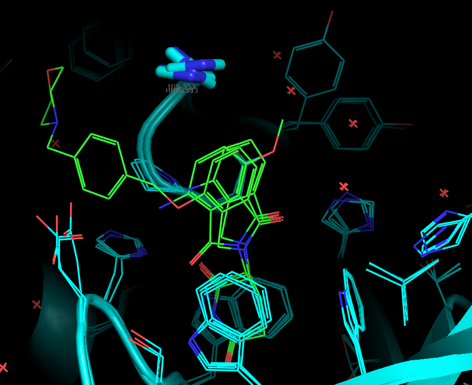
<font size="2"><b>Figure 8</b>. The aligned crystal structures of CRBN-IMiD complex used for ensemble docking with enumurated datebase, which is to enrich covalent binding hits engaging HIS-353.</font><br>

#### Preparing Ligand before Docking
<p style="text-align: justify;">
I utilised the flexible sidechain mode of AutoDock4 (AD4) for the covalent docking workflow. This method involves masking the target covalent residue's atom types and charges in the PDBQT grid map, while the ligand-adduct is "anchored" to the protein backbone at the Ca position. To prepare these conjugates, I defined a SMARTS-based transformation to create the ligand-sidechain adduct object in 2D (<b>Figure 9</b>).
</p>
<p style="text-align: justify;">
Furthermore, I performed a two-step conformer preparation:

1. Conformational Sampling: Initial 3D rotamers were generated using the ETKDG method followed by MMFF minimisation.
2. Pharmacophore Alignment: I applied a shape-alignment filter, selecting only those conformers where the cyclic imide pharmacophore maintained an $RMSD < 2$ Å relative to the bioactive glutarimide pose.
</p>
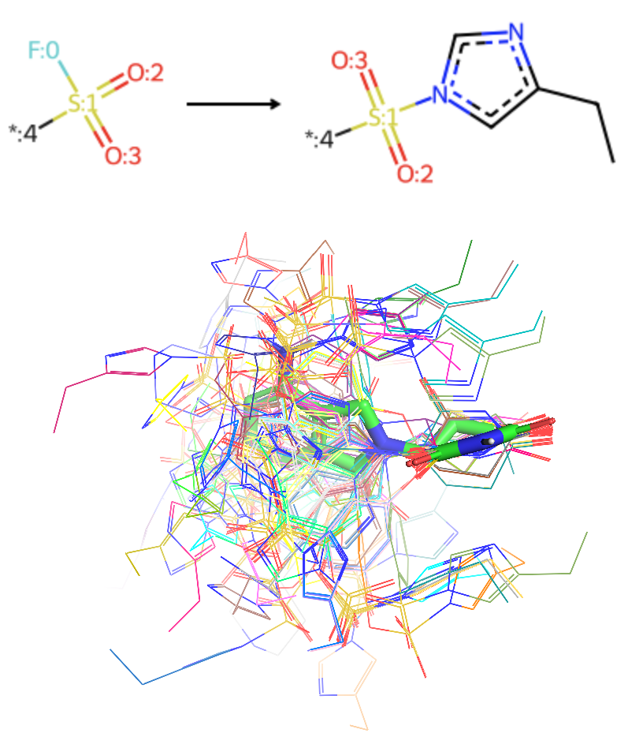
<font size="2"><b>Figure 9</b>. The SMARTS reaction for preparing histidine covalent ligand adducts used in flexible sidechain docking, followed by Glutarimide MCS pharmacophore shape alignment to select the initial conformer of each ligand.</font>
<br><br>
<p style="text-align: justify;">
Through providing a pre-aligned "bioactive-like" starting conformation, the AD4 Genetic Algorithm only needs to explore the remaining freely rotatable torsions under translational and rotational transformations, significantly improving the efficiency of the search within the fixed grid.
</p>

#### Overcoming Docking Pose Drift with Custom Constraints
<p style="text-align: justify;">
A common challenge in virtual screening is <b>"pose drift"</b>, where ligands dock into peripheral cavities rather than the intended pocket. Even with a defined grid box (20-30 Å), we often observe clusters where the ligand deviates from the reference IMiD coordinates. For example, in one test case below, 4 out of 5 docking clusters occupied sites distal to the IMiD pocket (<b>Video 10</b>).
</P>
<video controls>
  <source src="photos_and_videos/video_10.mp4" type="video/mp4">
</video>
<font size="2"><b>Vedio 10</b>. A covalent CRBN docking example showing diverse binding modes generated from AD4 algorithm and scoring functions, which must require further filtration and selection.</font>
<br><br>
<p style="text-align: justify;">
While commercial software like <b>Schrödinger Glide</b> offers built-in constrained docking by core or/and shape, I developed a custom solution by instructing my AI agent to write an RDKit-based post-docking filter (<b>Text 11</b>). This function calculates the MCS-based RMSD of the glutarimide core against the reference crystal pose. Since the docking was performed in a fixed coordinate system, no further alignment is required - We can simply filter for poses that maintain the essential binding geometry of the imide headgroup.

```python
def get_mcs_rmsd(query_sdf_path, ref_sdf_path, aligned_sdf_path, aligned=False, cutoff=2.0):

    confs = []
    with Chem.SDMolSupplier(query_sdf_path, removeHs=True, sanitize=True) as suppl_query:
        for conf in suppl_query:
            if conf is None: continue
            confs.append(conf)

    with Chem.SDMolSupplier(ref_sdf_path, removeHs=True, sanitize=True) as suppl_ref:
        ref_mol = suppl_ref[0]
        
    mcs = rdFMCS.FindMCS([confs[0], ref_mol], completeRingsOnly=True, ringMatchesRingOnly=False)
    patt = Chem.MolFromSmarts(mcs.smartsString)

    #check patt contains imide
    imide_smarts = "[!#1]1(-[#6]-[#6]-[#6](-[#7]-[#6]-1=[#8])=[#8])-[!#1]"
    imide_mol = Chem.MolFromSmarts(imide_smarts)
    if not patt.HasSubstructMatch(imide_mol):
        print("Warning: auto MCS does not contain a cyclic imide group, use defined cyclic imide as MCS instead")
        patt = imide_mol
    refMatch = ref_mol.GetSubstructMatch(patt)

    rms_min = None
    best_conf_id = None
    for i, conf in enumerate(confs):
        mv = conf.GetSubstructMatch(patt)
        if aligned == False:
            rms = AllChem.CalcRMS(conf, ref_mol, map=[list(zip(mv, refMatch))])
        else:
            rms = AllChem.AlignMol(conf, ref_mol, atomMap=list(zip(mv, refMatch)))
        if (rms_min is None) or (rms < rms_min):
            rms_min = rms
            best_conf_id = i

    if rms_min <= cutoff:
        with Chem.SDWriter(aligned_sdf_path) as writer:
            conf_with_hs = Chem.AddHs(confs[best_conf_id], addCoords=True)
            conf_with_hs.SetProp("_RMSD_MCS_to_ref", str(rms_min))
            writer.write(conf_with_hs)
        print(f"{aligned_sdf_path} is best valid conformation ID: {best_conf_id} with MCS RMSD: {rms_min} to {ref_sdf_path}")
        return best_conf_id, rms_min
    else:
        print(f"No valid conformation found with MCS RMSD <= {cutoff} A for {query_sdf_path} against {ref_sdf_path}")

        return None, None
```
<font size="2"><b>Text 11.</b> The Python function to get RMSD values of MCS (i.e., cyclic imide) from query conformations (e.g., docked) to a reference in SDF format, in order to get the best matched pose for final selection.</font><br>

### Virtual Screening Results
<p style="text-align: justify;">
Following several days of intensive computation locally using the docking strategies described above, I successfully refined the <i>in silico</i> chemical space for covalent CRBN binders and degraders targeting <b>IKZF2</b> and <b>WIZ</b>. The virtual screening for covalent ligands in the binary and <b>IKZF2</b> ternary complexes was relatively straightforward, as two target histidines are in close proximity to the IMiD binding site near the G-loop (<b>Figure 12, rows 2 & 3</b>). In contrast, CYS-11 in the <b>WIZ</b> neosubstrate is more distal from the glutarimide-binding pocket (<b>Figure 12, row 1</b>). This structural gap necessitates "PROTAC-like" bifunctional scaffolds to bridge the distance and ensure effective proximity for covalent engagement.
</p>
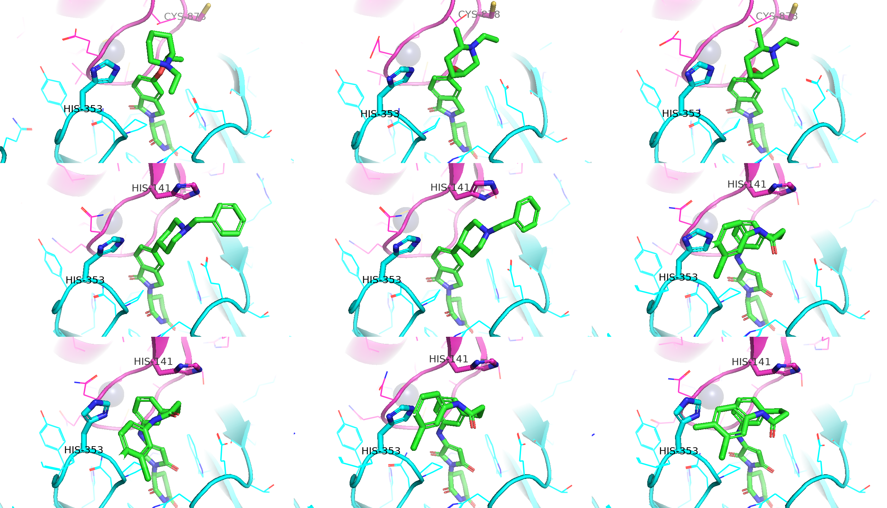
<font size="2"><b>Figure 12</b>. Some packing states in ternary complex co-crystal structures available for <b>WIZ</b> (upper row, 8TZX/9DJX) and <b>IKZF2</b> (middle and lower rows, 7U8F/7LPS), showing different proximities needed for developing covalent modalities to stabilise coresponding complexes.</font><br>

#### Covalent CRBN Binders and IKZF2 Degraders
<p style="text-align: justify;">
For the covalent CRBN binders (binary system), 36554 valid poses passed the initial docking and pharmacophore filter (<b>Video 13</b>). To streamline downstream QSAR and generative AI studies, these 3D poses were converted back to 2D canonical SMILES. I decided to remove stereochemical labels at this stage, as the chiral center at the C3 position of the glutarimide ring is known to racemise rapidly <i>in vivo</i>.
</p>
<video controls>
  <source src="photos_and_videos/video_13.mp4" type="video/mp4">
</video>
<font size="2"><b>Video 13</b>. All ensemble docking poses that are selected to match the Glutarimide pharacophore in reference ligands from binary co-crystallography (4TZ4/5V3O/8OJH).</font>
<br><br>
<p style="text-align: justify;">
The resulting 14042 unique molecules were filtered using three empirical criteria to ensure drug-likeness and minimise docking artifacts:

1. <b>Binding Score (AD4 covalent mode):</b> $< -10$ kcal/mol (to ensure the basic proximity needed).
2. <b>Molecular Weight (MW):</b> $< 500$ Da (to mitigate the inherent bias of docking algorithms toward larger molecules).
3. <b>Rotatable Bond Count (nRotB):</b> $< 7$ (to keep conformational stability while limit entropic penalties).

These rigorous filters refined the library from over 14000 candidates to a high-priority set of approximately 1500 compounds (<b>Figure 14</b>).
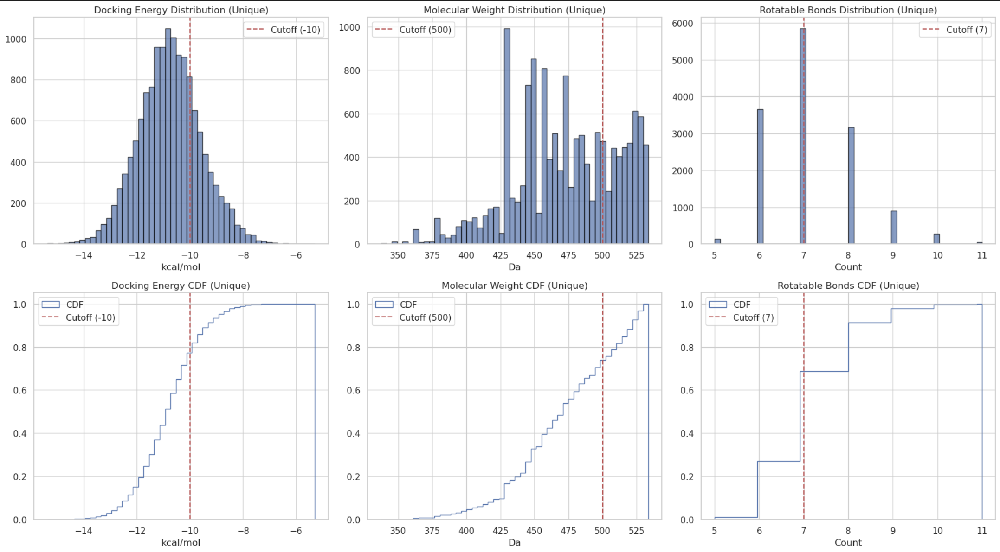
<font size="2"><b>Figure 14</b>. The distribution and cumulative plots of positive candidates enrichment passing 3 defined criteria for covalent CRBN binders.</font>
<br><br>
<p style="text-align: justify;">
For the IKZF2 covalent MG degraders, I adjusted the thresholds to reflect the increased complexity of the ternary interface: I loosened the MW and nRotB limits (< 550 Da and < 8) but tightened the binding score cutoff (< -11 kcal/mol). This ensured high complementarity within the ternary complex (<b>Video 15</b> & <b>Figure 16</b>). Approximately 1000 entries were prioritised, with several candidates showing excellent shape complementarity to the aromatic pharmacophores in reference, providing strong structural hypotheses for further medicinal chemistry optimisation.
</p>
<video controls>
  <source src="photos_and_videos/video_15.mp4" type="video/mp4">
</video>
<font size="2"><b>Video 15</b>. All ensemble docking poses that are selected to match the Glutarimide pharacophore in reference ligands from IKZF2 ternary complexes (7U8F/7LPS).</font>
<br><br>
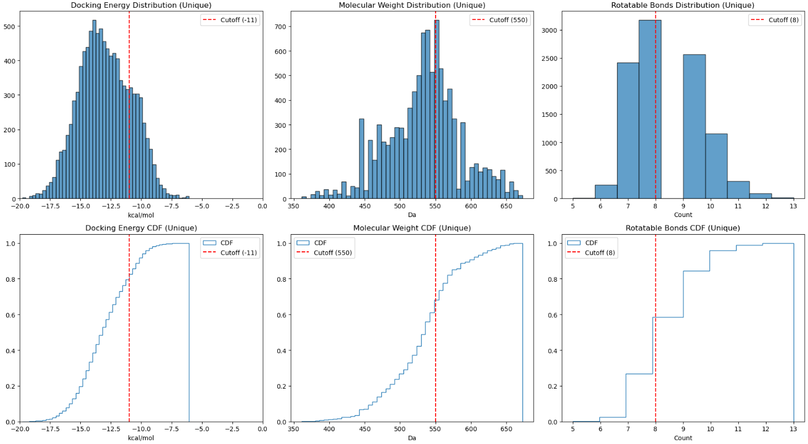
<font size="2"><b>Figure 16</b>. The distribution and cumulative plots of positive candidates enrichment passing 3 tailored criteria for IKZF2 covalent MGs.</font><br>

#### Covalent WIZ Degraders
<p style="text-align: justify;">
Targeting CYS-11 in the CRBN-WIZ complex presented a greater challenge - Cysteine residues typically require different warheads than histidine, and as noted, the residue is located further from the binding interface. To focus the library, I calculated the <b>Shortest Bonding Pathlength (SBP)</b>, the number of bonds on the 2D graph from the imide nitrogen to the electrophilic carbon, using a custom RDKit function. I restricted the library to precursors with a SBP >= 13 to ensure the linker was long enough to reach the target residue (<b>Figure 17</b>).
</p>
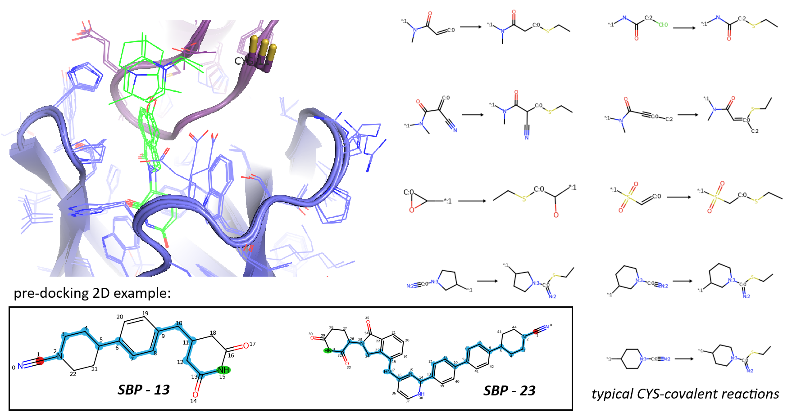
<font size="2"><b>Figure 17</b>. For WIZ covalent degraders, a pre-docking process to focus the library with cysteine dependency. Those candidates with at least 13 SBP were chosen for subsequent covalent additions and ligand preparations.</font>
<br><br>
<p style="text-align: justify;">
Covalent docking against <b>WIZ</b> yielded several promising drug-like hits (<b>Video 18</b>). For this set, I tightened both the docking score (< -12.5 kcal/mol) and nRotB (< 7) to prioritise molecules with high <b>"cooperativity"</b> and low internal strain (<b>Figure 19</b>). Interestingly, the top-scoring candidates predominantly featured cyanamide warheads, with fewer types of Michael acceptor. Many of these "winners" adopted L-shaped conformations, perfectly complementing the CRBN-WIZ interface. Again these designs are attached in my GitHub/HuggingFace repository for any potential development of interest.
</p>
<video controls>
  <source src="photos_and_videos/video_18.mp4" type="video/mp4">
</video>
<font size="2"><b>Video 18</b>. All ensemble docking poses that are selected to match the Glutarimide pharacophore in reference ligands from WIZ ternary complexes (8TZX/9DJX).</font>
<br><br>
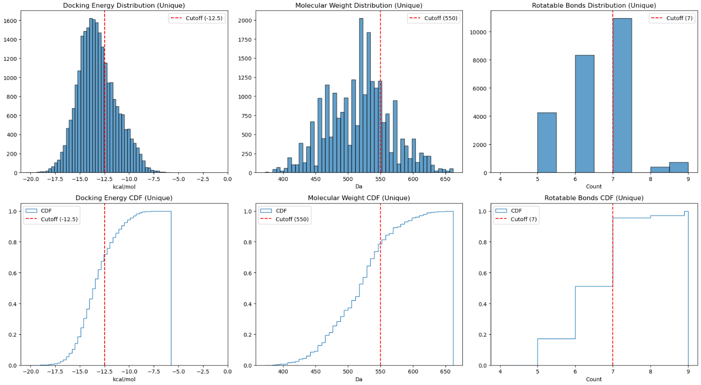
<font size="2"><b>Figure 19</b>. The distribution and cumulative plots of positive candidates enrichment passing 3 tailored criteria for WIZ covalent PROTACs.</font><br>

## QSAR Modelling
<p style="text-align: justify;">
Following the virtual screening results, I merged the prioritised covalent candidates with the original non-covalent CRBN binder pool to create an enriched, multi-modality database. To ensure high-quality leads, I applied a final filter using the <b>Quantitative Estimate of Drug-likeness (QED)</b> score, setting a threshold of > 0.5. This index balances several physicochemical properties, including Lipinski’s rules, to assess overall lead-likeness. This refined the covalent library to approximately 2500 compounds, a size comparable to the non-covalent pool (~4000 compounds) derived from open-source and Enamine databases (<b>Figure 20</b>).
</p>
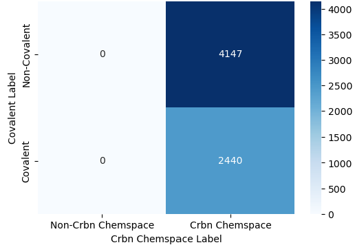
<font size="2"><b>Figure 20</b>. The distribution of chemical space between covalent and non-covalant classes for CRBN.</font>
<br><br>
<p style="text-align: justify;">
For the initial QSAR study, I focused on a <b>classification task</b>. Binary classification is commonly used in industrial drug discovery, particularly when dealing with early-stage, high-throughput data that may be inherently noisy before making any initial decision. Establishing a robust classifier serves as a prerequisite, providing a "prior" that guides subsequent regression models and generative AI toward higher-confidence predictions.
</p>

### Classification Task: Identifying Covalent CRBN Ligands
<p style="text-align: justify;">
While chemical identification is frequently used in toxicology to flag hazardous substances, I applied it here to distinguish covalent CRBN candidates using ML. Since I had previously annotated the common covalent warheads (<b>Figure 7</b>), the purpose was to develop a model that captures the "chemist's intuition" — automating the recognition of these specific modalities within the CRBN-binding context.
</p>
<p style="text-align: justify;">
<b>In practical cheminformatics, success often depends on focusing on the specific chemical domain</b>. During data preparation, I initially experimented with including covalent molecules from other Enamine libraries unrelated to CRBN (lower left, <b>Figure 20</b>). However, I found that this "out-of-domain" data acted as just noise. Including positives for general covalency that were negative for CRBN binding confused the model, making it difficult for the machine to extract the specific structural patterns, whether through molecular fingerprints or graph-based matrices, that define the CRBN-covalent space.
</p>
<p style="text-align: justify;">
Unless one is pursuing a large-scale <b>transfer learning</b> approach (which would require a massive expansion of the "non-CRBN/non-covalent" negative space as shown in upper left, <b>Figure 20</b>), it is generally more effective to build a lean, focused model. From my personal working experience, a model tailored specifically to the chemical project at hand is often more accurate and interpretable than a generalised one.
</p>

#### Classic Machine Learning with SVM and Tree Classifiers (RF and XGBoost)
<p style="text-align: justify;">
Based on my experience, some classic ML approaches could provide robust performance and generalisation on the QSAR classification task given the limited datasize of chemical space here below 10000. To start with, I tested support vector machine (SVM) based on a proper string of Morgan fingerprints (set size 8192 with radius 2 according to the occupancy screening in advance). The majority of on-bits come from the imide pharacophore as shown in <b>Figure 21</b>, which is not a concern for me since SVM could decide boundaries based on sparse but critical features in hyperplane.
</p>
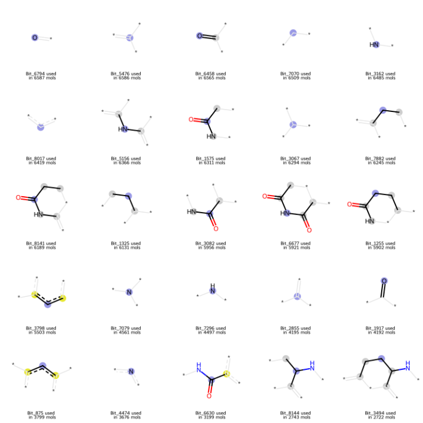
<font size="2"><b>Figure 21</b>. The most common structures of on-bit from CRBN chemical space embedding with Morgan fingerprints (size 8192 with radius 2).</font>
<br><br>
<p style="text-align: justify;">
To ensure the generalisation capability of ML model, different Murcko scaffolds were distributed into training (80%) and testing (20%) sets. After the grid search of hyperparameters in scikit-learn (e.g., cost, gamma and kernal for SVM classifier) based on cross-validation within training set, the model performed so well that the prediction on testset almost reach 1.0 accuracy as well as 1.0 MCC (Matthews correlation coefficient - a statistical index balancing both precision and recall qualities in binary classification). To double check reasoning (one advantage of most classic ML models), I plotted the importance of top 25 fingerprint features in SVM (<b>Figure 22 top</b>). The interpretation is clear - the model did learn and make decisions from those most likely warheads including bits which are relevent to Sulfonyl Fluorides and Acrylamides.
</p>
<p style="text-align: justify;">
Two common tree models, Random Forest (RF) and extreme gradient boosting (XGBoost), were tried next. Following similar CV grid search (max branch depth, number of estimators, sub-sample/features etc.) for model training and tuning, all testing performaces are perfect as expected. The XGBoost model demonstrated most steady classification and reasonable interpretation after several runs, where more weights/bias were built on Cyanamide-relevent bits in complex decision trees (<b>Figure 22 down</b>).
</p>
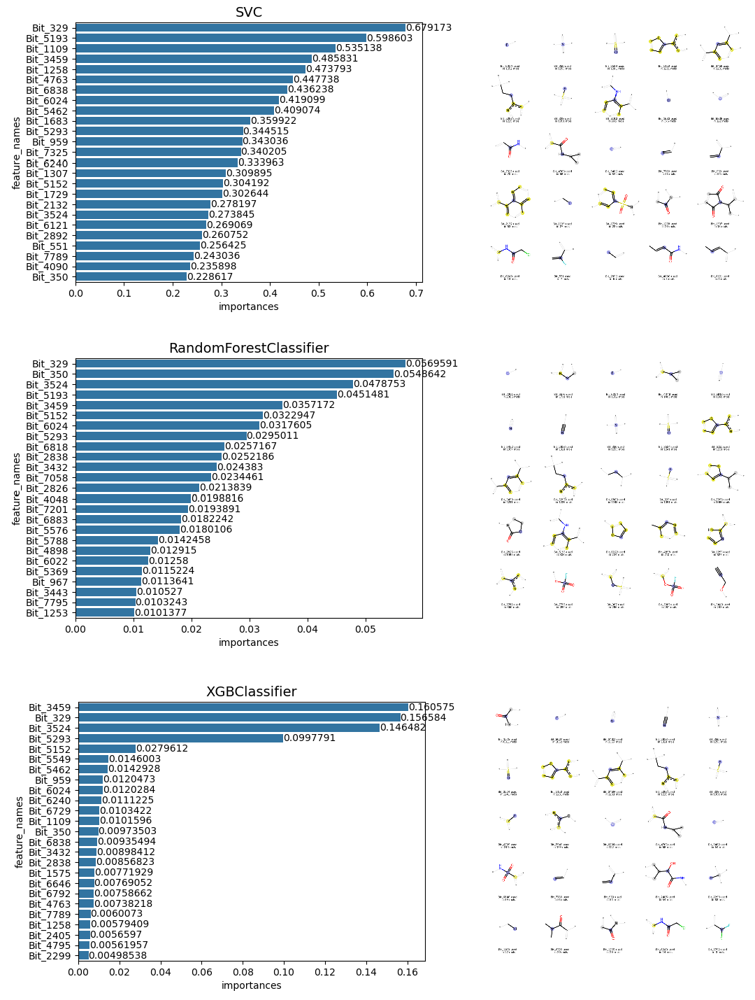
<font size="2"><b>Figure 22</b>. The top-feature importance plot based on Morgan fingerprints respectively for tuned SVM, RF and XGBoost models, to classify the covalent modality from others in CRBN chemical space.</font>
<br><br>
<p style="text-align: justify;">
Noteworthy, tuning the hyperparameter with grid search is a time-consuming step to establish a model properly in days. With the help from Claude, Bayesian optimisation using optuna module was coded and tried to search for a best set of hyperparameters (<b>Test 23</b>). Under 100 iterations in just few hours, the algorithm found a XGBoost model which is competible to classify all testset correctly based on similar feature importances. This reminded me with MCMC (Markov Chain Monte Carlo - also a type of Bayesian/Gaussian process if I am correct) for searching low-energy molecular conformations efficiently as I mentioned in the previous blog. <b>To find global optimum/minimum in a distribution or an energy landscape for example, we might not always need all trials based on <i>ab initio</i> physics. The sufficient high-quality data, empirical paradigms (e.g., DFT, force-field potential or even just model architecture) and approperate statistical methods together could lead us to the ground truth faster despite the approximation in anyway (i.e., the ideology of engineering).</b> This is my simple understanding so far in data science as a physical chemist doing interdisciplinary studies...                      
</p>

```python
#Tuning hyperparameters of XGBoost using Optuna based on Bayesian optimization
import optuna

def objective(trial):
    # 1. Define the search space
    param = {
        'n_estimators': trial.suggest_int('n_estimators', 100, 1000),
        'max_depth': trial.suggest_int('max_depth', 2, 10),
        'learning_rate': trial.suggest_float('learning_rate', 0.01, 0.2, log=True),
        'subsample': trial.suggest_float('subsample', 0.5, 1.0),
        'colsample_bytree': trial.suggest_float('colsample_bytree', 0.5, 1.0),
        'gamma': trial.suggest_float('gamma', 0, 1.0),
    }
    # 2. Initialize model with suggested params
    model = XGBClassifier(**param, random_state=42, eval_metric='logloss')
    
    # 3. Use train data to get a score (using MCC as our metric)
    score = cross_val_score(model, 
                            X_train,
                            y_train,
                            cv=5,
                            scoring='matthews_corrcoef').mean()
    
    return score

# 4. Create a "study" and optimize
study = optuna.create_study(direction='maximize')
study.optimize(objective, n_trials=100)
print(f"Best Params: {study.best_params}")

#Testing best XGBoost from Optuna
best_xgb_optuna = XGBClassifier(**study.best_params,
                                random_state=42,
                                eval_metric='logloss')
best_xgb_optuna.fit(X_train, y_train)
y_pred = best_xgb_optuna.predict(X_test)
acc_optuna = accuracy_score(y_test, y_pred)
mcc_optuna = matthews_corrcoef(y_test, y_pred)
print(f"Optimised XGBoost - Test MCC: {mcc_optuna:.4f} | Test ACC: {acc_optuna:.4f}")
```
<font size="2"><b>Text 23.</b> The Python code to tune hyperparameters of XGBoost classifier with Bayesian optimisation.</font><br>

#### Classification by Deep Learning with Graph Neural Networks (GCN, GAT and GIN)
<p style="text-align: justify;">
The classification model was also built with graph neural network. Following some tutorials from DeepChem, TeachOpenCADD and blogger MaximeLabonne as well as advise from AI agent, each CRBN molecule in my dataset was embeded into graph data at first. For example with Thalidomide (<b>Figure 24</b>), the adjacent matrix was created to show bonding connectivities (edge) among all atoms (node) - a simplied version of graph. In DeepChem modules, I found its graph featuriser convert the chemical structure into 3 sub-matrices: <b>node features, edge index and edge features</b>. The first and second matrix are compulsory to construct a graph while the edge features (e.g., bond types) might be redundent since node features already contain such information implicitly. Moreover, the massage passing algorithm and mean/max/sum aggregate for pooling update in most classic GNN architectures are not very sensitive to edge type as far as I have learnt from LLMs, and we are not predicting chemical properties that are closely associated with bond. Hence, the matrix of edge features was dropped for simplicity as suggested by workshop.                  
</p>
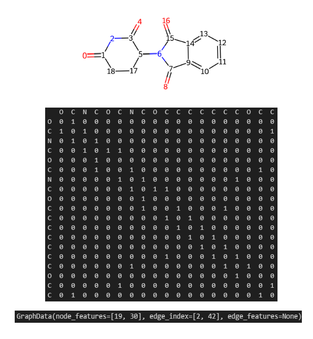
<font size="2"><b>Figure 24</b>. The adjacent matrix of Thalidomide as a simply encoded graph in 2D, and the actual object featurised by DeepChem module for this study.</font>
<br><br>
<p style="text-align: justify;">
To be honest, deep learning (DL) is seldom used for my daily QSAR work as computational chemist in biotech, neither am I software engineer nor mathematician by professional training. There was no knowledge of Linear Algrebra or Matrix Transformation in my mind. During the xmas holiday before I wrote this blog, I took a certain amount of time to get familiar with PyTorch and modularise each DL step in the workflow below based on my coding experience and AI proficiency:
<br><br>
<b>1. Graph Featurisation, Collate, Scaffold-based Splitting and Dataloader Preparation</b><br>
<b>2. Epoch Training with backward propagation together with Adam Optimisation on BCE loss function</b><br>
<b>3. Some Regularisations to avoid over-fitting as well as The Evaluation using MCC for binary classification</b><br> 
<b>4. Tunning Hyperparameters - batch size, learning rate and hidden dimensions in each GNN architecture</b><br>
see the notebook of pytorch_GNN_classification.ipynb for more details...
</p>
<p style="text-align: justify;">
For the forward architecture, I tried Graph Convolutional Network (GCN), Graph Isomorphism Network (GIN) as well as Graph Attention Network (GAT). Both GCN and GIN were inspired from TeachOpenCADD tutorial while GAT was proposed by my Gemini agent (<b>Text 25</b>). There might be inappropriate layers and readout functions from professional perspective of data science, however a recent research from cheminformaticians in GSK suggested: <b>The GNN architecture is less important than hyperparamter optimisation and feature engineering for QSAR study</b> (DOIs in reference). With the deepchem graph featurised from rdkit canonical smiles string (stereo-ignored), I decided to focus on tuning hyperparameters in order to maximise GNN performances on the classification of covalent CRBN ligand modalities. 
</p>

```python
import torch
import torch.nn as nn
import torch.nn.functional as Fun
from torch.nn import Linear, Sequential, BatchNorm1d, ReLU
from torch_geometric.nn import GCNConv, GINConv, GATConv, global_mean_pool, global_add_pool

# Set device to GPU RTX5070 in Hao's laptop
device = torch.device("cuda" if torch.cuda.is_available() else "cpu")

# Common hyperparameters to be tuned later
HIDDEN_DIM = 32
BATCH_SIZE = 64
LEARNING_RATE = 0.001
EPOCHS = 100
EARLY_STOP_PATIENCE = 5
# Some regularisation parameters to prevent overfitting issue given limited crbn data < 10000
DROPOUT_P = 0.5
WEIGHT_DECAY = 1e-4
# Initial random seed which will be varied 2 more times (21, 0) for robustness testing
RANDOM_SEED = 42

# Define GNN architectures: GCN, GIN, and GAT
class GCN(torch.nn.Module):
    def __init__(self, in_features, dim_h):
        super().__init__()
        # GCNConv layers for graph convolutional operations
        self.conv1 = GCNConv(in_features, dim_h)
        self.conv2 = GCNConv(dim_h, dim_h)
        self.conv3 = GCNConv(dim_h, dim_h)
        self.lin = torch.nn.Linear(dim_h, 1)
    def forward(self, graphs_in):
        # Normalize input to a list of graph objects
        graphs_list = list(graphs_in)
        x_list = []
        edge_list = []
        batch = []
        node_offset = 0
        # Build concatenated Tensors (x, edge_index, batch vector)
        for i, g in enumerate(graphs_list):
            # Convert node features and edge index to 2 tensors and move them to device (GPU/CUDA)
            nf = torch.tensor(g.node_features, dtype=torch.float32).to(device)
            ei = torch.tensor(g.edge_index, dtype=torch.long).to(device)            
            # Shift edge indices by the current node offset
            edge_list.append(ei + node_offset)
            x_list.append(nf)
            # Create batch vector for this graph (all nodes get the same graph index)
            n_nodes = nf.shape[0]
            batch.append(torch.full((n_nodes,), i, dtype=torch.long, device=device))
            node_offset += n_nodes
        # Concatenate all features, edges, and batch vectors
        x = torch.cat(x_list, dim=0)
        e = torch.cat(edge_list, dim=1)
        batch = torch.cat(batch, dim=0)
        # GCN layers with ReLU activations
        x = self.conv1(x, e)
        x = x.relu()
        x = self.conv2(x, e)
        x = x.relu()
        x = self.conv3(x, e)
        # Global Pooling with mean aggregation for GCN graph-level prediction
        x = global_mean_pool(x, batch)
        # Readout layer
        x = Fun.dropout(x, p=DROPOUT_P, training=self.training)
        x = self.lin(x) # Output logits (unscaled)
        return x.squeeze(-1) # Squeeze to shape [batch_size]    

class GIN(torch.nn.Module):
    def __init__(self, in_features, dim_h):
        super(GIN, self).__init__()
        # Add BatchNorm for GIN stability
        self.conv1 = GINConv(
            Sequential(Linear(in_features, dim_h), BatchNorm1d(dim_h), ReLU(), 
                      Linear(dim_h, dim_h), BatchNorm1d(dim_h), ReLU())
        )
        self.conv2 = GINConv(
            Sequential(Linear(dim_h, dim_h), BatchNorm1d(dim_h), ReLU(), 
                      Linear(dim_h, dim_h), BatchNorm1d(dim_h), ReLU())
        )
        self.conv3 = GINConv(
            Sequential(Linear(dim_h, dim_h), BatchNorm1d(dim_h), ReLU(), 
                      Linear(dim_h, dim_h), BatchNorm1d(dim_h), ReLU())
        )
        self.lin = Linear(dim_h, 1)
    def forward(self, graphs_in):
        graphs_list = list(graphs_in)
        x_list = []
        edge_list = []
        batch = []
        node_offset = 0
        for i, g in enumerate(graphs_list):
            nf = torch.tensor(g.node_features, dtype=torch.float32).to(device)
            ei = torch.tensor(g.edge_index, dtype=torch.long).to(device)
            edge_list.append(ei + node_offset)
            x_list.append(nf)
            n_nodes = nf.shape[0]
            batch.append(torch.full((n_nodes,), i, dtype=torch.long, device=device))
            node_offset += n_nodes
        x = torch.cat(x_list, dim=0)
        e = torch.cat(edge_list, dim=1)
        batch = torch.cat(batch, dim=0)
        # GIN layers with MLPs and BatchNorm
        x = self.conv1(x, e)
        x = self.conv2(x, e)
        x = self.conv3(x, e)
        # Global Pooling with sum aggregation for GIN graph-level prediction
        x = global_add_pool(x, batch)
        x = Fun.dropout(x, p=DROPOUT_P, training=self.training)
        x = self.lin(x)
        return x.squeeze(-1)  

class GAT(torch.nn.Module):
    def __init__(self, in_features, dim_h, heads=3):
        super(GAT, self).__init__()
        # GATConv layers for graph attention operations
        self.conv1 = GATConv(in_features, dim_h, heads=heads, concat=True)
        self.conv2 = GATConv(dim_h * heads, dim_h, heads=heads, concat=True)
        self.conv3 = GATConv(dim_h * heads, dim_h, heads=1, concat=False)
        self.lin = Linear(dim_h, 1)
    def forward(self, graphs_in):
        graphs_list = list(graphs_in)
        x_list = []
        edge_list = []
        batch = []
        node_offset = 0
        for i, g in enumerate(graphs_list):
            nf = torch.tensor(g.node_features, dtype=torch.float32).to(device)
            ei = torch.tensor(g.edge_index, dtype=torch.long).to(device)
            edge_list.append(ei + node_offset)
            x_list.append(nf)
            n_nodes = nf.shape[0]
            batch.append(torch.full((n_nodes,), i, dtype=torch.long, device=device))
            node_offset += n_nodes
        x = torch.cat(x_list, dim=0)
        e = torch.cat(edge_list, dim=1)
        batch = torch.cat(batch, dim=0)
        # GAT layers with attention mechanism
        x = self.conv1(x, e)
        x = x.relu()
        x = self.conv2(x, e)
        x = x.relu()
        x = self.conv3(x, e)
        # Global Pooling with mean aggregation for GAT graph-level prediction
        x = global_mean_pool(x, batch)
        x = Fun.dropout(x, p=DROPOUT_P, training=self.training) 
        x = self.lin(x)
        return x.squeeze(-1)
```
<font size="2"><b>Text 25.</b> The Python code for 3 common GNN architectures in PyTorch used for chemical classification based on DeepChem GraphData.</font><br>
<p style="text-align: justify;">
Following the grid search (<b>Figure 26</b>), all GNN models are able to identify those covalent molecules in CRBN chemical space with perfect precision, recall and accuarcy (> 0.95). Compared to GCN and GAT, the GIN model demonstrated most robust mcc stabilities regardless of hyperparameters. Similarly with Bayesian optimisation, a well-tuned graph model (GIN with hidden_dim=16, batch_size=256 and learning_rate=0.001) was rapidly obtained for nearly all correct classifications (mcc up to 0.98). <b>It seems that both classic ML and GNN approaches are able to deal with the chemical classification task in this study... Then how about regression modelling?</b>
</p>
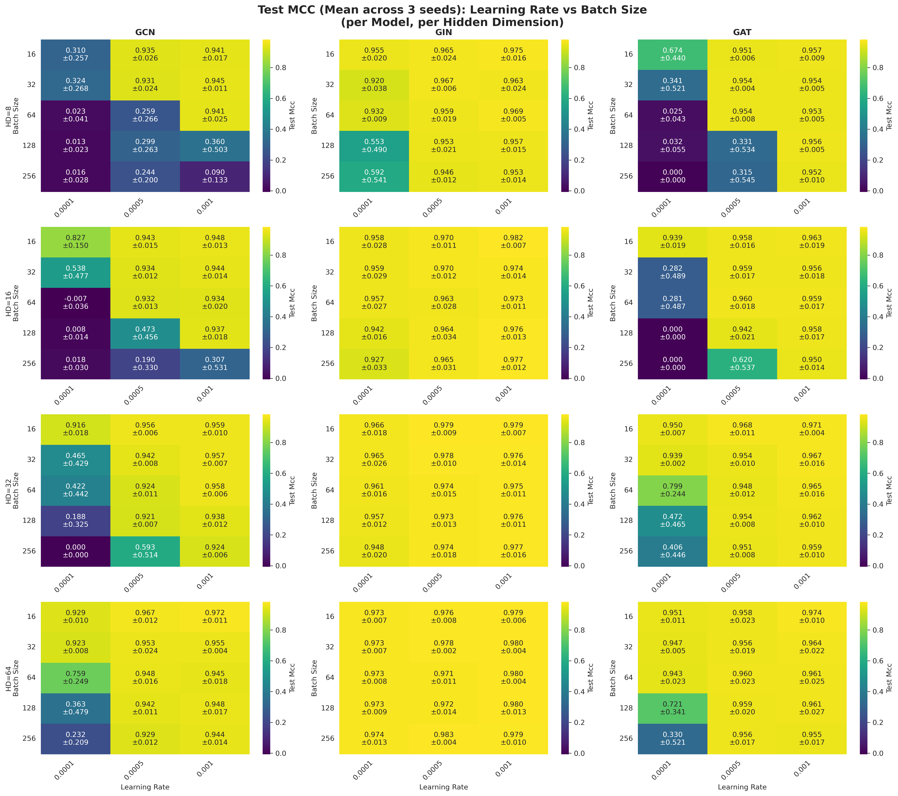
<font size="2"><b>Figure 26</b>. The hyperparameter screening result for all graph models trained to make binary classification between covalent and non-covalent CRBN binders.</font><br>

### Regression Task on Electrophilicity
<p style="text-align: justify;">
In covalent drug discovery, the estimation of reactivity is a common task for medicinal chemists. With complex biophysical assays, we are able to measure indicators like Kd/ki for binding kinetics in covalent mechanism. Alternatively, the glutathione (GSH) reactivity assay could provide high throughput screening on chemicals targeting a cysteine residue in approximation. For computational chemistry, the reactivity might be even evaluated roughly from ligand electrophilicity through calculating HOMO, LUMO energies and their gaps based on QM approach. Since I have annotated classes of covalent and non-covalent compounds in CRBN chemical space empirically, it would be sensible to check if such label could be characterised and quantified through numerical numbers based on the scientific computation.                   
</p>

#### Quantum Chemical Calculations
<p style="text-align: justify;">
To calculate molecualr electronic properties reliably within the CRBN chemical space, I instructed my agent for a workflow starting from ETKDG(MMFF) conformational search, xTB geometry optimisations to single-point energy calculations with UMA model as well as Boltzmann averaging on ensembles in vaccum (<b>Figure 27</b>). This is a compromised approach to screen over 10000 hit candidates, considering slow computation speed with MD simulations and DFT calculations but acceptable accuracy with atomic NNP energies and semi-empirical xTB properties based on my previous experience.  
</p>
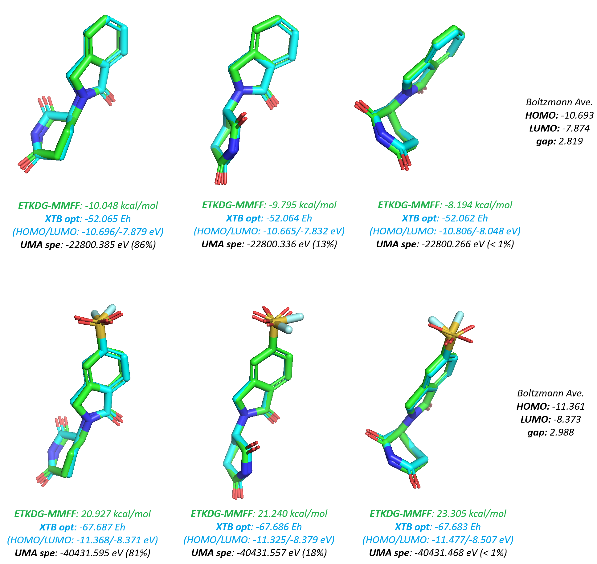
<font size="2"><b>Figure 27</b>. The example to calculate eletrophilic properties (conformationally dependent) for 2 distinct CRBN ligand modalities respectively based on a quick & dirty statistical quantum mechanical workflow.</font>
<br><br>
<p style="text-align: justify;">
Comparing HOMO, LUMO and gap energies between the covalent and the non-covalent class of my CRBN chemical space (<b>Figure 28</b>), some statistically significant differences (p < 0.05 in MWU and t-test) could be observed: All covalent species tend to have lower LUMO, higher HOMO and smaller gap values than others. The distribution of xTB-based electrophilicity index is also more significant for the covalent class. 
</p>
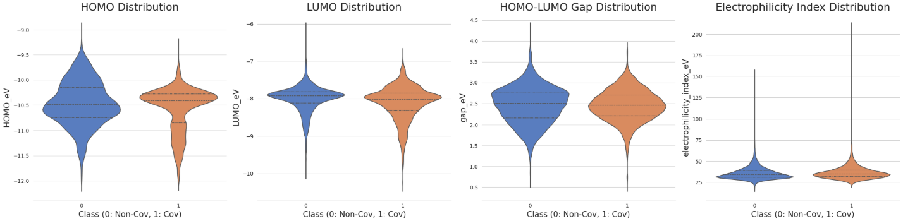
<font size="2"><b>Figure 28</b>. The distribution of HOMO, LUMO, gap energies and electrophilicty index (&omega;) in covalent and non-covalent classes of CRBN chemical space.</font><br>

$$\omega = \frac{(E_{H} + E_{L})^2}{4(E_{L} - E_{H})}$$

<p style="text-align: justify;">
Nevertheless, these molecular-level QM features are insufficient to classify the covalency confidently in desired chemical space. This was also confirmed by researches from Bayer and Boehringer Ingelheim (DOIs in reference). We might need some further physical calculations associated with the warhead fragment (e.g., atom attribute of Fukui indices in FMO, reaction activation energy with nucleophilic residue etc.) to convince ourself of actual covalency for CRBN-based binder or degrader... Given that LUMO value is more relevant to electrophilicity (i.e., the orbital which accept electrons) and its distribution almost approach Gaussian-type in our chemical space (<b>Figure 28 second</b>), I decided to test some regression models on it.               
</p>

#### Benchmarking ML Models for LUMO Prediction
